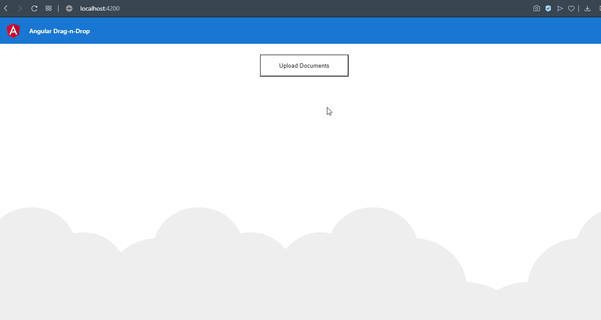

[![Contributors][contributors-shield]][contributors-url]
[![Forks][forks-shield]][forks-url]
[![Stargazers][stars-shield]][stars-url]
[![Issues][issues-shield]][issues-url]
[![MIT License][license-shield]][license-url]

<!-- PROJECT LOGO -->
<br />
<p align="center">
  <a href="https://github.com/CESARBR/angular-libraries/projects/lib-tooltip">
    
  </a>
  <h3 align="center">Angular Tooltip</h3>

  <p align="center">
    Tooltip directive adds a behavior to elements in your Angular applications where you can add a tooltip
    when hover the elements
    <br />
    <br />
    <a href="https://github.com/CESARBR/angular-libraries/issues?q=is%3Aissue+is%3Aopen+%5Btooltip%5D">Report Bug</a>
    ·
    <a href="https://github.com/CESARBR/angular-tooltip/wiki">Wiki</a>
  </p>
</p>

<div>
  <summary><h2 style="display: inline-block">Table of Contents</h2></summary>
  <ol>
    <li>
      <a href="#about-the-project">About The Project</a>
      <ul>
        <li><a href="#built-with">Built With</a></li>
      </ul>
    </li>
    <li>
      <a href="#getting-started">Getting Started</a>
      <ul>
        <li><a href="#prerequisites">Prerequisites</a></li>
        <li><a href="#installation">Installation</a></li>
      </ul>
    </li>
    <li>
      <a href="#usage">Usage</a>
      <ul>
        <li><a href="#UsageFlags">Usage Flags</a></li>
      </ul>
    </li>
    <li><a href="#roadmap">Roadmap</a></li>
    <li><a href="#contributing">Contributing</a></li>
    <li><a href="#license">License</a></li>
    <li><a href="#contact">Contact</a></li>
  </ol>
</div>

## About The Project



### Built With

* [Angular](https://angular.io)
* [TypeScript](https://www.typescriptlang.org)
* [SASS](https://sass-lang.com)

## Getting Started

To get a local and running follow these simple steps.

### Prerequisites

Install NPM packages

1. npm
```sh
npm install npm@latest -g
```

### Installation

1. With [npm](https://npmjs.org/) installed, run.
```sh
npm i @cesarbr/angular-tooltip
```

2. Verify if tooltip is added on your dependencies
```json
"dependencies": {
  ...
  "@cesarbr/angular-tooltip": "^0.1.3"
  ...
}
```

## Usage

Import TooltipModule on module
```ts
import { NgModule } from '@angular/core';
import { AppComponent } from './app.component';
import { TooltipModule } from '@cesarbr/angular-tooltip';

@NgModule({
  declarations: [AppComponent],
  imports: [TooltipModule],
  providers: [],
  bootstrap: []
})
export class AppModule { }
```

Using the directive on your component
```html
<div tooltip="Example tooltip" placement="top">My tooltip host!</div>
```

## Usage Flags
Angular Tooltip has flags where you can customize your component:
|Usage|Flag|Default|Values|Type
|---|---|---|---|---|
|Tooltip orientation.|`placement`|`left`|`left|top|bottom|right`|`string`|
|Margin between the tooltip and it's host.|`offset`|`8`|`0...99999`|`number`|
|Horizontal tooltip position, positive numbers will push it to the left, while negative numbers will push it to the right|`leftOffset`|`0`|`-99999...99999`|`number`|
|Vertical tooltip position, positive numbers will push it down, while negative numbers will push it up.|`topOffset`|`0`|`-99999...99999`|`number`|
|Allows for breaking lines withing the same word.|`wordBreak`|`none`|`Any string`|`string`|
|Only shows the tooltip if the text is overflowed (not entirely showing up, with '...').|`showOnlyIfOverflowEllipsis`|`false`|`true|false`|`boolean`|
|Text color.|`textColor`|`black`|`Any string`|`string`|
|Background color.|`backgroundColor`|`white`|`Any string`|`string`|

Usage example
```html
<div tooltip="{{tooltipExample}}"
    placement="top"
    offset="10"
    leftOffset="30"
    topOffset="23"
    wordBreak="Cut"
    textAlign="right"
    showOnlyIfOverflowEllipsis="true"
    textColor="black"
    backgroundColor="white">
    <button
    class="upload-button">Upload Documents</button>
</div>
```
## Roadmap

See the [open issues](https://github.com/CESARBR/angular-libraries/issues?q=is%3Aissue+is%3Aopen+%5Btooltip%5D) for a list of proposed features (and known issues).

## Contributing
You can set up a test enviroment by running the command **npm run build-watch** followed by **ng serve**, the build-watch command will build the tooltip and watch for code changes, ng serve will run the test project with the lib.

Contributions are what make the open source community such an amazing place to be learn, inspire, and create. Any contributions you make are **greatly appreciated**.

1. Fork the Project
2. Create your Feature Branch (`git checkout -b feature-IssueNumber`)
3. Commit your Changes (`git commit -m 'Create a new feature or fix bug'`)
4. Push to the Branch (`git push origin feature-IssueNumber`)
5. Open a Pull Request

## License

Distributed under the MIT License. See `LICENSE` for more information.

## Contact

Project Link: [https://github.com/CESARBR/angular-tooltip](https://github.com/CESARBR/angular-tooltip)

<!-- MARKDOWN LINKS & IMAGES -->
[contributors-shield]: https://img.shields.io/github/contributors/CESARBR/angular-tooltip.svg?style=for-the-badge
[contributors-url]: https://github.com/CESARBR/angular-tooltip/graphs/contributors
[forks-shield]: https://img.shields.io/github/forks/CESARBR/angular-tooltip.svg?style=for-the-badge
[forks-url]: https://github.com/CESARBR/angular-tooltip/network/members
[stars-shield]: https://img.shields.io/github/stars/CESARBR/angular-tooltip.svg?style=for-the-badge
[stars-url]: https://github.com/CESARBR/angular-tooltip/stargazers
[issues-shield]: https://img.shields.io/github/issues/CESARBR/angular-tooltip.svg?style=for-the-badge
[issues-url]: https://github.com/CESARBR/angular-tooltip/issues
[license-shield]: https://img.shields.io/github/license/CESARBR/angular-tooltip.svg?style=for-the-badge
[license-url]: https://github.com/CESARBR/angular-tooltip/blob/main/LICENSE
